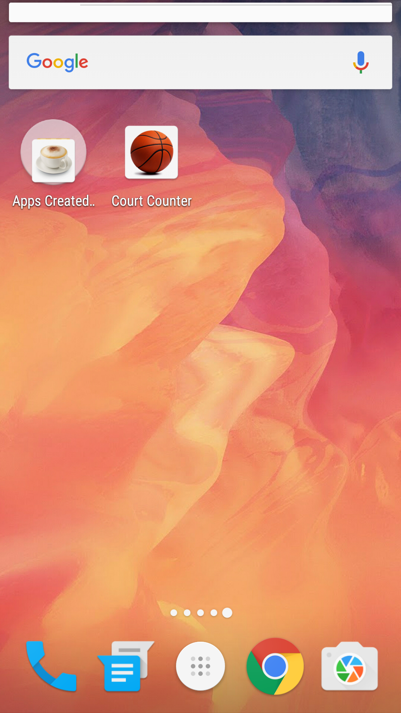
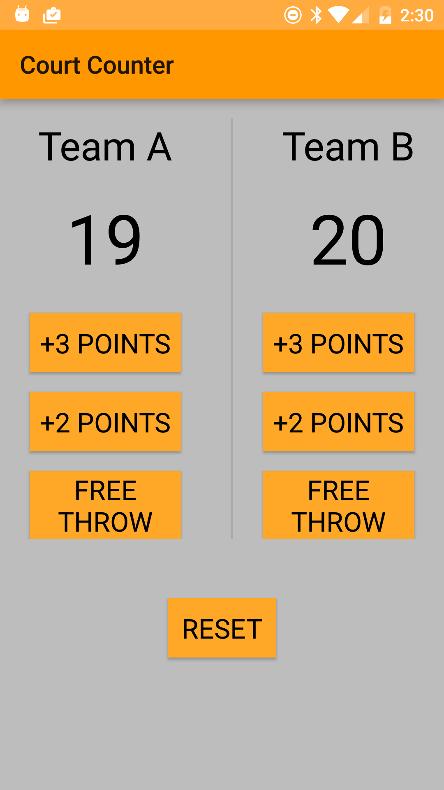
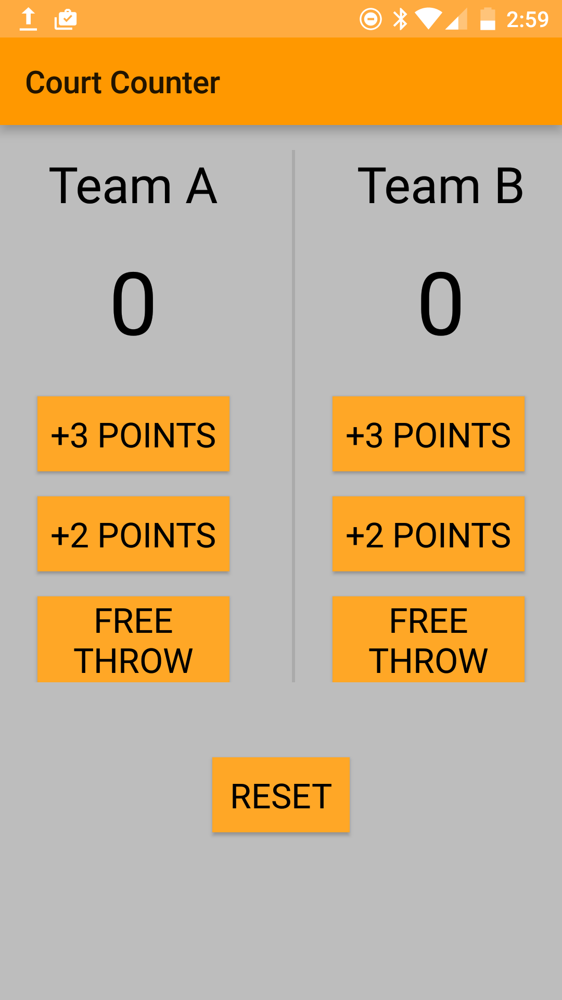

Court Counter App
===================================

This App is designed to monitor the scores of a BasketBall Game when either of the team score a free throw worth 1 point or a field goal worth 2 or 3 points.

Pre-requisites
--------------

- Android SDK v23
- Android Build Tools v23.0.2
- Android Support Repository v23.3.0

Getting Started
---------------

This sample uses the Gradle build system. To build this project, use the
"gradlew build" command or use "Import Project" in Android Studio.

<!---->

 

