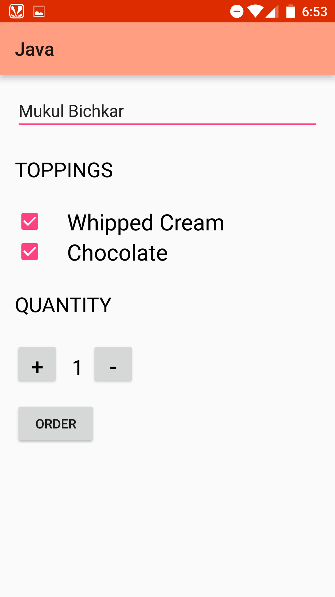

CoffeOrdering (Java) App
===================================

This app allows user to enter his Name as well as additional toppings like Whipped Cream, Chocolate to the coffee. Also, one can select the number of Coffee cups.
On pressing Order Button one can generate an email invoice with relevant details.

Pre-requisites
--------------

- Android SDK v23
- Android Build Tools v23.0.2
- Android Support Repository v23.3.0

===================================

Getting Started
---------------

This sample uses the Gradle build system. To build this project, use the
"gradlew build" command or use "Import Project" in Android Studio.

